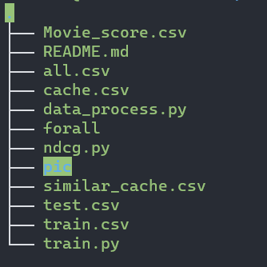

# WebInfo Lab1

> 小组成员：
>
> 张展翔 PB20111669
>
> 黄鑫 PB20061174
>
> 刘阳 PB20111677

## 分工：

- 张展翔：stage3
- 黄鑫：stage1
- 刘阳：stage2

三人均完成所分部分的全部工作。

## Stage 1 爬虫爬取豆瓣电影，书籍信息

### 实验目标

​	针对给定的电影、书籍ID，爬取其豆瓣主页，并解析其基本信息，获取电影数据的其基本信息、剧情简介、演职员表，以及书籍数据的基本信息、内容简介、作者简介.

### 实验流程分析

#### 爬取工具

在python3.9环境下使用requests包对指定页面进行请求和分析.

主要环境/工具:

- python 3.9
- requests(请求页面)
- fake_useragent(生成伪造UA)
- lxml(xpath解析页面信息)
- re(正则解析页面信息)
- threading(多线程实现)

#### 反爬措施与应对策略

实验中所遇到的网站反爬措施包括：

##### UA检测：对有异常UA的请求，无法正常访问页面

解决方案：使用fake_useragent，每次请求后更换一次UA.

```python
header['User-Agent'] = str(fake_useragent.UserAgent().random)
```

##### IP检测：滑动验证码验证/扫码验证登陆: 同一IP下当爬取速度达到一定阈值，就需要通过扫码/滑动验证码验证并登陆后才能正常访问.

解决方案：

- 控制爬取速度，在成功爬取一个URL后使爬虫sleep指定时间间隔防止触发反爬机制(失败，出于某种原因还是会被检测到)
- 手动登陆获取Cookie(失败,Cookie有时限，且登录状态下访问到达一定速度/数量也会被检测并触发滑动验证码验证)
- 使用selenium,在触发滑动验证码验证时模拟鼠标滑动破解(可靠性和性能低，不采用)
- 使用高匿IP代理池, 每爬取一定数量/被检测到时就更换一次代理IP, 突破检测，同时也解决了爬虫的速度限制，可以使用多线程或异步爬虫的方式来进一步提高速度(成功，效果极佳)

通过API获取并返回代理IP(代码中接口已失效),通过该代理进行请求

```python
def get_proxy():
    try:
        PROXY_API_URL = "https://h.shanchendaili.com/api.html?action=get_ip&key=HUe820e7971028093030zNPr&time=10" \
                        "&count=1&protocol=http&type=json&only=1 "
        proxy_json = requests.get(PROXY_API_URL).text
        server = re.findall("(?<=\"sever\":\").*?(?=\")",
                            proxy_json)[0]
        port = re.findall("(?<=\"port\":).*?(?=,)",
                          proxy_json)[0]
        host = server + ":" + port
    except:
        return None
    proxy = {
        'http': 'http://' + host,
        'https': 'https://' + host,
    }
    return proxy
```

爬取失败更换代理ip

```python
try:
                response = requests.get(_url, headers=header, cookies=cookie, proxies=proxy, timeout=8)
                movie_info = page_parser_movie(response)
                break
except Exception as e:  # 同一ip爬取失败达到3次则更换一次ip,若再失败就放弃该url
                print("\n")
                print(e)

                if same_proxy_retry < 3:
                    print("Crawling error:retrying for {re} time(s)\n".format(re=same_proxy_retry + 1))
                    same_proxy_retry += 1
                    continue

                else:
                    same_proxy_retry = 0
                    retry += 1
                    print("Crawling error:change proxy\n".format(re=retry + 1))
                    proxy = get_proxy()
```

#### 页面解析方法

​	由于直接使用正则表达式，表达式编写较为繁琐且程序鲁棒性低.而各个电影之间基本信息的页面排布属性不同，故直接通过xpath获取也较为低效不合适.故爬虫采用***xpath解析和正则表达式解析结合***的方式获取页面信息.

​	以电影的基本信息为例,由于基本信息主要排布在id为info的区域中,使用lxml中带有的xpath解析器获取该区域本身及所有子结点的信息并转化为string，再交由正则表达式解析


```python
    other_info = ''.join([_ for _ in tree.xpath("//*[@id=\"info\"]/descendant-or-self::text()")])
    # 获取属性id="info"的结点信息，将其本身与其所有子节点的信息转化为string
    ...
        "director": re.findall("(?<=导演: ).[^\n]*", other_info),
        "author": re.findall("(?<=编剧: ).[^\n]*", other_info),
        "actor": re.findall("(?<=主演: ).[^\n]*", other_info),
        "official_website": re.findall("(?<=官方网站: ).[^\n]*", other_info),
        "movie_type": re.findall("(?<=类型: ).[^\n]*", other_info),
        "film_set": re.findall("(?<=制片国家/地区: ).[^\n]*", other_info),
        "lang": re.findall("(?<=语言: ).[^\n]*", other_info),
        "release_time": re.findall("(?<=上映日期: ).[^\n]*", other_info),
        "duration": re.findall("(?<=片长: ).[^\n]*", other_info),
        "alias": re.findall("(?<=又名: ).[^\n]*", other_info),
        "IMDb_id": re.findall("(?<=IMDb: ).[^ \n]*", other_info),
        "rank_mark": re.findall("(?<=ratingValue\": \").*?(?=\")", content),
        "review_num": re.findall("(?<=ratingCount\": \").*?(?=\")", content),
```

### 结果展示

​	爬虫共爬取到988份指定id的书籍信息以及995项指定id的电影信息，共有12份无效数据ID和5份无效电影ID

​	以下为无效的电影/书籍URL

```python
# 无效的电影URL
'https://movie.douban.com/subject/1310174/', broken
'https://movie.douban.com/subject/1309046/', broken
'https://movie.douban.com/subject/1768351/', broken
'https://movie.douban.com/subject/1796939/', broken
'https://movie.douban.com/subject/1295428/', broken
```

```python
# 无效的书籍URL
'https://book.douban.com/subject/1394253/', broken
'https://book.douban.com/subject/4112874/', broken
'https://book.douban.com/subject/1059336/', broken
'https://book.douban.com/subject/1456034/', broken
'https://book.douban.com/subject/1918734/', broken
'https://book.douban.com/subject/1025723/', broken
'https://book.douban.com/subject/1903968/', broken
'https://book.douban.com/subject/1079509/', broken
'https://book.douban.com/subject/4886245/', broken
'https://book.douban.com/subject/1767388/', broken
'https://book.douban.com/subject/1051363/', broken
'https://book.douban.com/subject/1803022/', broken	
```

​	爬取到的每个项目的信息以dict list的形式保存在json文件中，每个列表项包含了书籍/电影的ip以及指定爬取信息的字典.以下为爬取到的信息展示（此为未经过进一步清洗的数据，数据清洗在后续实现，此处仅作展示.使用MongoDB Compass展示）

#### 电影信息展示


#### 书籍信息展示


## Stage 2

### 文件结构

#### 算法文件

- boolSearch.py: 向外提供布尔查询的接口，具体使用请参照 `python3 boolSearch.py -h` 。
- encoding.py: 依据 elias gamma 的压缩编码方式，对一个数字进行解码和编码。
- indexCompressor.py: 压缩编码/解码器，对一个词汇的倒排索引进行编码、解码。
- parseFile.py: 对 stage1 得到的 book 和 movie 文件进行处理、再存储。
- tableMaker.py: 生成倒排表。

#### 数据文件/文件夹

- book_keywords/* : 存储 book 类型文档各个词汇的倒排索引。
- books/* : 存储各个 book ，用于返回查询的到的文档。
- movie_keywords/* movies/* : 同上。
- book_table.json movie_table.json : 存储两种文档词项的编号，以寻找倒排索引。

### 实验环境

实验环境使用了 virtualenv ，python 版本为 3.7.13 。

### 文本的预处理

​	文本的预处理需要对获取的文本进行提取信息并进行分词，对于书籍，我提取了书籍的名字、书籍介绍、作者介绍，对于电影，我提取了电影的名字和电影简介，作为该项目的全部文本。分词采用了THU的分词算法thulac，将文本表征为关键词集合。我还采用了百度的停用词库，对于取得的关键词集合，删去其中的停用词，来构成该文档的最终关键词集合，以书籍类型为例：

```python
def get_book_wordlist():
    lac1 = thulac.thulac(model_path='../../models', seg_only=False, filt=True)
    briefs = []
    stop_words = [line.strip() for line in open('baidu_stopwords.txt', 'r').readlines()]
    stop_words.append(' ')
    with open('../stage1/Book_info.json', 'r') as book_file:
        books = json.loads(book_file.read())
        for book in books:
            message = book['name'][0]
            if (isinstance(book['description_of_book'], str)):
                message += book['description_of_book']
            if (isinstance(book['description_of_author'], str)):
                message += book['description_of_author']
            words = lac1.cut(message)
            for word in words.copy():
                if word[0] in stop_words:
                    words.remove(word)
            briefs.append(words)
    return briefs
```

### 倒排表的生成

​	对于上一步生成的关键词集合，我们只需要统计关键词在出现的文档，就可以得到关键词的倒排表。这里为了便于取用文档，而不必要将所有文档加载进内存，写了一个 `parseFlie.py` 文件，用来分开stage1得到的结果，进行了重编号，放在 ./books/ 和 ./movies/ 文件夹下。

​	对于生成的倒排表，需要进行压缩存储。这里采用了 elias-gamma 算法进行压缩，参考了github上的一些代码，写了一个 `indexCompressor.py` 模块来为倒排表进行编码和解码，该模块有一个初始化函数，存储倒排表。build 方法对初始化函数传进去的倒排表进行压缩，返回一个 bytes 类型的对象，即为压缩后的倒排表。decode 方法对传入的 bytes 类型的对象进行解码，返回该类型的倒排表，为一个元素均为 int 型的列表：

```python
from encoding import *

class Compressor:
    def __init__(self, index_list):
        self.index_list = index_list

    def build(self):
        compress_data = bytes('', 'ascii')
        for index in self.index_list:
            elias_code = elias_gamma(index)
            compress_data += bytes([int(x, 2) for x in split_code_to_8_bits(add_leading_zeros(elias_code))])
        return compress_data

    def decode(self, data: bytes):
        num = int.from_bytes(data, 'big', signed=False)
        bit_list = []
        for i in range(data.__len__() * 8):
            bit_list.append(num % 2)
            num = num // 2
        bit_list.reverse()
        
        res = []
        i = 0
        while i < bit_list.__len__():
            len = 0
            exp = 0
            offset = 0
            while bit_list[i] == 0:
                i += 1
            while bit_list[i] == 1:
                len += 1
                i += 1
            exp = 1 << len
            while len > 0:
                len -= 1
                i += 1
                offset = (offset << 1) + bit_list[i]
            i += 1
            res.append(exp + offset)
        return res
```

​	这样在生成倒排表的同时就可以进行压缩，这里将压缩后的倒排表中的索引按照关键词的序号进行存储在 ./book_keywords/ 和 ./movie_keywords/ 下。由于没想明白跳表指针怎么压缩，就没有建立跳表指针，经过观察每一个关键词的索引表其实并不长，其实跳表指针的必要性不大（）。

### 布尔查询

​	布尔查询的操作都在 `boolSearch.py` 文件中实现。查询方式为：

```
> python3 boolSearch.py -h

boolSearch -t search_type -s search_string -f search file
                        search_type: movie or book     
                        search_string: bool expression
                        result file: default result.txt
```

​	文件中实现了2个函数 merge 和 extract ，用来将两个索引表取并集和交集，就不放出来了。查询得到的结果保存在命令行中输入的文件中，若参数缺省则默认为 result.txt 。

### 结果展示

​	这里来查询编号为69、74、77号的电影。编号为69号的电影为《西西里的美丽传说》，采用关键词 '西西里 and 传说' 进行查询，得到的结果仅有《西西里的美丽传说》这一部电影；采用关键词 '美丽 and 传说' 进行搜索，得到的结果有四部电影。因为搜索到的文件包含电影的名字和简介，这里展示的结果中我删去了大部分的简介内容。

```
name: 西西里的美丽传说
description:
　　当我还只是十三岁时，1941年春末的那一天...
```

```
name: 惊情四百年
description:
　　这是一部阴森诡异的吸血鬼传说...


name: 亚瑟和他的迷你王国
description:
　　为了保住外婆的花园...


name: 诸神之战
description:
　　不堪忍受奥林匹斯..


name: 天堂口
description:
　　阿峰（吴彦祖饰）...


name: 西西里的美丽传说
description:
　　当我还只是十三岁时...
```

​	然后查询编号为74号的电影《小鞋子》，采用关键词 '鞋 and 比赛' ，得到的结果如下：

```
ame: 小鞋子
description:
　　家境贫寒的男孩Ali（AmirFarrokhHashemian）帮妹妹Zahra（BahareSeddiqi）取修补好的鞋子时...
```

​	最后查询编号为77号的电影《沉默的羔羊》，采用关键词 '沉默 and 羔羊' ，得到的结果如下：

```
name: 汉尼拔
description:
　　本片是《沉默的羔羊》十周年纪念日推出的续集...


name: 沉默的羔羊
description:
　　联调局学院学员ClariceM.Starling（乔迪·福斯特饰）受行为科学组的JackCrawford（斯科特·格伦饰）指派...
```

​	上面的查询可能得到多余的结果，根据采用搜索的词汇的冷门程度可能出现数量不等的多余结果，但是都能得到我们想要查询的电影，结果可以认为正确。

## Stage 3

### 实验目标

基于第一阶段爬取的豆瓣 Movie/Book 信息、我们提供的豆瓣电影与书籍的评分记 录以及用户间的社交关系，判断用户的偏好

### 实验内容

本次评分的预测只利用了Movie_score.csv文件评分部分，没有使用contract文件

#### 测试集与训练集划分

训练集和测试集划分比例为8：2

利用sklearn库中的model_selection_train_test_split函数完成划分

#### 预测相关计算方法

预测方法采用基于用户的均值中心化算法来进行计算
$$
pred(u,i)=\hat{r_{ui}}=\bar{r_u}+\frac{\Sigma_{v\in U}sim(u,v)*(r_{vi}-\bar{r_v})}{\Sigma_{v\in U}{|sim(u,v)|}}
$$
其中，用户间的相似度$sim(u,v)$则利用了皮尔逊相关系数来计算
$$
\rho_{X,Y}=\frac{cov(X,Y)}{\sigma_X\sigma_Y}=\frac{E[(X-\mu_X)(Y-\mu_Y)]}{\sigma_X\sigma_Y}
$$
对于仅有少数正常评分或者全部评分为0的用户，无法计算其与其他用户的相似度，故舍去不做预测

#### ndcg计算

最后，使用sklearn库中的metrics.ndcg_score函数完成对ndcg的计算

### 结果展示

#### 文件结构




- Movie_score.csv为提供电影评分样本
- **all.csv为最后预测评分与实际评分汇总**
- cache.csv为用户-电影评分矩阵
- data_process.py为数据处理代码
- forall为总的评分样本汇总文件（未使用）
- ndcg.py为ndcg计算代码
- pic为截图保存文件夹
- similar_cache.csv为用户相关度矩阵
- test.csv和train为测试集和训练集
- train.py为预测评分代码

#### nDCG计算

如下图为测试机中实际分数与预测分数的对应表


经计算可得

ndcg=0.9814199692967567

ndcg@5=0.9815151048429968

ndcg@10=0.9421806099621497
